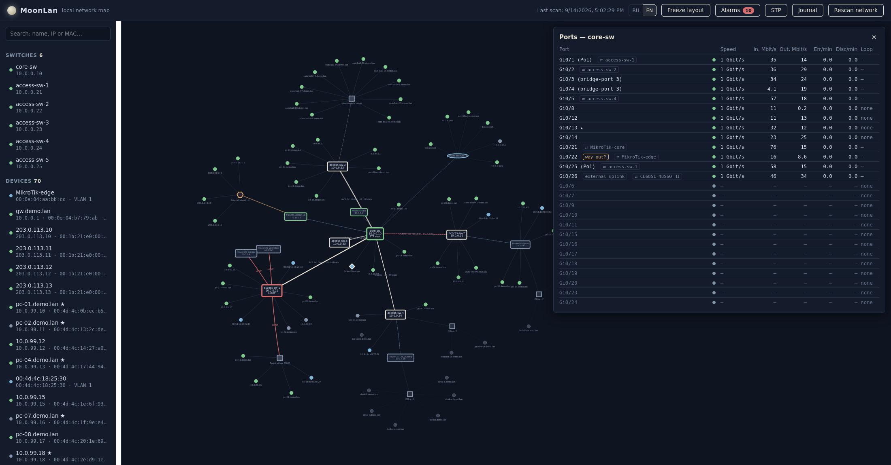
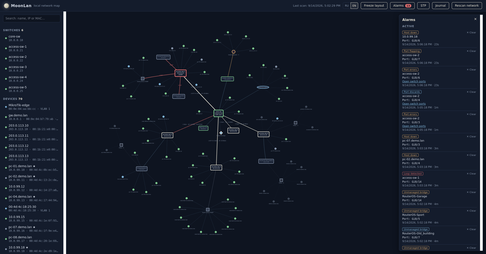

# 🌙 MoonLan

**MoonLan** is an open-source network monitoring and topology discovery service for Linux.

It automatically builds a physical network topology from switch data collected through **SNMP**, continuously monitors hosts, ports, counters, STP, LLDP and loops, and presents everything through an interactive web interface.

> An open-source alternative to LanTopoLog.
> **License:** MIT

[](https://www.python.org/)
[](LICENSE)
[](CHANGELOG.md)

---

## 📸 Screenshots

### Network Map



*Automatically discovered topology with LACP trunks, unmanaged switches, offline device groups and live port counters.*

### Alarm Panel



*Port errors, discards and host outages with one-click access to the switch port table.*

---

## ✨ Features

### 🔌 SNMP & Switch Discovery

* SNMP v2c polling of managed switches.
* Device name, ports, speeds and statuses.
* Per-switch SNMP configuration.
* Per-switch polling time budgets.
* Slow switches delay themselves instead of blocking the entire network map.
* Slow-but-responsive switches are reported as **late**, not unreachable.
* Dead OIDs are temporarily suspended after repeated timeout-only failures.
* Suspended OIDs are automatically retried after a configurable cooldown.
* Switch-specific SNMP settings inherit from the global `snmp:` configuration.

---

### 🗺️ Topology Discovery

* Automatic physical topology discovery.
* Direct switch-to-switch link inference using FDB intersection.
* Prevents false links between the rays of a star topology.
* Switch identity is determined from its full MAC set:

  * bridge MAC;
  * interface MACs;
  * management-IP MACs.
* One-way visibility has a dedicated fallback exclusion rule.
* Link cards show ports on both ends.
* Link stability is maintained across the last three polls.
* Previous topology remains visible if a scan fails.

---

### ⚡ LACP

* IEEE 802.3 LAG-MIB support.
* LACP bundles are represented as a single logical link.
* Member ports are shown in the link card.
* Active member count determines displayed capacity.
* Degraded LAGs are explicitly represented.

Example:

```text
LACP 1×1 Gbit/s (1/2 members)
```

---

### 🏷️ VLAN Awareness

* Q-BRIDGE-MIB support.
* Host PVID detection.
* VLAN names shown in host cards.
* VLAN information available in the device list.
* VLAN-aware STP diagnostics.

---

### 🖥️ Host Discovery

* MAC address table collection from every managed switch.
* Host IP discovery through router ARP tables.
* Reverse DNS host-name resolution.
* One IP belongs to exactly one MAC.
* DHCP reassignment does not leave duplicate host records.
* New MAC addresses require confirmation before becoming devices.
* ARP-confirmed devices can bypass the normal confirmation delay.

---

### 📍 Honest Host Placement

MoonLan deliberately avoids pretending to know more than the network data proves.

* Hosts visible only through trunks are marked **approximate**.
* Trunk-only devices can be grouped under:

```text
Beyond the trunk · N
```

* Devices seen only through uplinks are not incorrectly attached to the local switch.
* Uplink-only devices are placed under **Not on map**.
* ARP-only devices remain searchable and pingable.
* Devices behind switches that MoonLan does not poll remain visible where evidence supports their placement.

---

### 💤 Stable Offline Inventory

A host disappearing from a switch MAC table does not immediately disappear from the map.

* Hosts remain at their last known location for `host_grace_hours`.
* Offline devices are greyed out.
* Last-seen timestamps remain visible.
* Long lists of offline devices are grouped under:

```text
Offline · N
```

* ARP-only devices appear under **Not on map**.
* `python -m moonlan.diag --hosts` reports inventory completeness.

---

### 📡 LLDP

MoonLan uses LLDP together with FDB information to make topology decisions more reliable.

Supported information includes:

* chassis ID;
* port ID;
* system name;
* system description;
* management address;
* capabilities;
* local port matching.

Every discovered link identifies its source:

```text
lldp
fdb
both
```

Additional LLDP handling includes:

* named unmanaged bridges;
* capability-less neighbours;
* forwarded LLDP frame detection;
* LLDP/FDB mismatch reporting;
* port-label filtering;
* logical LACP-port handling;
* neighbour capability classification.

---

### 🌉 Unmanaged Switch Detection

When several devices appear behind one access port, MoonLan can represent the device as:

```text
Switch without SNMP
```

The threshold is configurable through:

```yaml
unmanaged_threshold: 3
```

LLDP-capable unmanaged bridges can instead appear as named devices with:

* system name;
* model;
* management addresses;
* capabilities.

Known bridges can be excluded from alarms using `known_bridges`.

---

### 🌲 Spanning Tree Protocol

MoonLan does not blindly trust placeholder BRIDGE-MIB values.

It distinguishes between:

* STP actually operating;
* STP disabled;
* unknown/incomplete STP information;
* fragmented spanning trees.

The STP panel provides:

* network-level verdict;
* root bridge;
* per-switch state;
* root cost;
* root port;
* topology changes;
* blocking ports.

Blocking ports are displayed as dashed red edges labelled:

```text
BLOCKING
```

The root bridge is visually highlighted.

Supported alarms:

```text
stp_root_changed
stp_topology_change
stp_fragmented
```

---

### 🔄 Loop Detection

There is no universal loop-detection MIB, so MoonLan uses vendor-specific profiles selected by `sysObjectID`.

Built-in profiles include:

| Profile         | Model              | sysObjectID       | Branch                |
| --------------- | ------------------ | ----------------- | --------------------- |
| `dlink-1210`    | DGS-1210-26 Rev.F1 | `…171.10.153.6.1` | `…171.11.153.1000.17` |
| `dlink-1210`    | DES-1210-28/ME     | `…171.10.75.15.2` | `…171.10.75.15.2.17`  |
| `dlink-des3526` | DES-3526           | `…171.10.64.1`    | `…171.11.64.1.2.12`   |

A switch that does not expose loop detection is reported as:

```text
Not reported over SNMP
```

It is **not** incorrectly reported as having no loops.

Supported alarms:

```text
loop_detected
loop_detection_disabled
```

A detected loop produces a red map edge labelled:

```text
LOOP
```

---

### 📈 Port Counters

MoonLan continuously monitors:

* traffic;
* errors;
* discards;
* utilization;
* packet counters;
* interface state;
* link changes.

Counters include:

```text
ifHCInOctets
ifHCOutOctets
ifInOctets
ifOutOctets
ifHCInUcastPkts
ifHCOutUcastPkts
ifInErrors
ifOutErrors
ifInDiscards
ifOutDiscards
ifOperStatus
ifHighSpeed
ifLastChange
```

Features include:

* per-direction 32-bit fallback;
* partial-walk recovery;
* per-port fallback requests;
* counter reset detection;
* stale-rate tracking;
* current LAG load;
* link-flap detection.

A missing counter is displayed as:

```text
—
```

It is **not** treated as `0`.

---

### ⚠️ Errors vs Discards

MoonLan deliberately separates physical errors from normal packet discards.

#### Errors

Usually associated with:

* bad cables;
* patch cords;
* duplex mismatches;
* failing transceivers;
* interference.

Alarm:

```text
port_errors
```

Default threshold:

```yaml
errors_per_minute: 5
```

#### Discards

Can be caused by:

* VLAN filtering;
* ACLs;
* storm control;
* buffer exhaustion;
* traffic bursts.

Alarm:

```text
port_discards
```

Default threshold:

```yaml
discards_per_minute: 500
```

Discards are informational and routed to Syslog by default.

---

### 🧬 Frame Corruption Detection

MoonLan detects suspicious MAC addresses that appear to be damaged copies of a real device's MAC.

A candidate must be:

* unconfirmed;
* IP-less;
* on the same port;
* within the configured Hamming distance of a confirmed MAC.

Configuration:

```yaml
corruption_hamming_bits: 8
corruption_macs_threshold: 5
```

Detected addresses stay off the topology map and are marked with:

```text
⚠
```

Alarm:

```text
port_frame_corruption
```

If port error counters independently support the diagnosis, the alarm can be escalated to critical.

---

### 🔀 Port Flapping

`ifLastChange` is monitored together with `ifOperStatus`.

This allows MoonLan to detect multiple link transitions between counter polls.

Configuration:

```yaml
flaps_per_window: 4
flap_window_minutes: 10
```

Alarm:

```text
port_flapping
```

The Ports panel displays the transition count and latest transition time.

---

### 🚨 Stateful Alarms

MoonLan maintains alarm state instead of treating every observation as a new event.

Supported alarm types include:

```text
host_down
switch_down
switch_stale
port_errors
port_discards
port_util
new_mac
port_hosts_down
lag_degraded
port_frame_corruption
unmanaged_bridge_detected
stp_root_changed
stp_topology_change
stp_fragmented
port_flapping
loop_detected
loop_detection_disabled
```

Features:

* hysteresis;
* automatic clearing;
* manual clearing;
* alarm persistence;
* stale-alarm cleanup;
* flap damping;
* event journal integration;
* notification cooldowns.

---

### 📣 Notifications

MoonLan supports:

* SMTP email;
* Telegram Bot API;
* Syslog UDP.

Notification routing is configurable per alarm type:

```yaml
alarm_notify:
  host_down: [email, telegram, syslog]
  switch_down: [email, telegram, syslog]
  port_errors: [syslog]
  port_discards: [syslog]
  port_util: [telegram, syslog]
```

Test all enabled channels with:

```bash
python -m moonlan.notify --test
```

---

### 📔 Event Journal

Important events are stored in SQLite:

* new MAC addresses;
* hosts going down;
* hosts recovering;
* alarm raises;
* alarm clears.

History survives service restarts.

---

### 🕵️ Diagnostics

MoonLan includes a dedicated diagnostic CLI.

Examples:

```bash
python -m moonlan.diag <switch_ip>
python -m moonlan.diag --host 10.0.0.51
python -m moonlan.diag --fdb 10.0.0.44
python -m moonlan.diag --topology
python -m moonlan.diag --stp
python -m moonlan.diag --loop
python -m moonlan.diag --hosts
python -m moonlan.diag --config
```

Diagnostic reports can be anonymized:

```bash
python -m moonlan.diag --topology --anonymize
```

Anonymization uses documentation-safe address and MAC ranges while keeping replacements stable throughout the report.

---

### 🎛️ Web Interface

MoonLan provides a two-panel web UI:

* searchable device list;
* interactive topology map;
* automatic refresh;
* port statistics;
* VLAN information;
* LACP details;
* LLDP information;
* STP state;
* loop state;
* alarms;
* host status;
* event journal.

The interface is currently **English-only**.

---

### 🧪 Demo Mode

MoonLan includes a virtual network generator for exploring the UI without physical switches.

The demo exercises:

* five-switch topology;
* LACP;
* VLANs;
* unmanaged switches;
* offline hosts;
* traffic counters;
* port errors;
* host outages;
* host recovery;
* new MAC discovery;
* LLDP;
* STP;
* blocking ports;
* loop detection;
* port flapping;
* frame corruption;
* stale switches;
* trunk-only devices;
* uplink-only devices.

---

## 🛣️ Roadmap

| Version | Status | Functionality                                                  |
| ------- | :----: | -------------------------------------------------------------- |
| v0.1    |    ✅   | SNMP polling, MAC tables, basic topology, web UI               |
| v0.2    |   ⏸️   | Manual map editing, context menus, layout export/import        |
| v0.3    |    ✅   | Ping monitoring, journal, host IPs and names                   |
| v0.4    |    ✅   | Accurate links, LACP, VLAN, unmanaged switches                 |
| v0.5    |    ✅   | Alerts, notifications, traffic thresholds, port errors         |
| v0.6    |    ✅   | LLDP, bridge detection, STP, port flapping                     |
| v0.6.1  |    ✅   | Multi-bridge ports, capability-less neighbours, LLDP matching  |
| v0.6.2  |    ✅   | One node per device, LLDP names, external uplinks, ports panel |
| v0.6.3  |    ✅   | Readable links, external-network demo, safer development       |
| v0.6.4  |    ✅   | Honest counters, remembered locations, edge/hint fixes         |
| v0.6.5  |    ✅   | Truncated-walk recovery and counter fallback                   |
| v0.6.6  |    ✅   | Independent OID failures and offline bridge groups             |
| v0.6.7  |    ✅   | Vendor-specific loop detection                                 |
| v0.6.8  |    ✅   | Model identification and shareable diagnostics                 |
| v0.6.9  |    ✅   | Correct uplink-only host placement                             |
| v0.6.10 |    ✅   | Trunk-only host grouping                                       |
| v0.6.11 |    ✅   | STP root handling and stable panel header                      |
| v0.6.12 |    ✅   | Per-switch SNMP settings and poll budgets                      |
| v0.6.13 |    ✅   | Honest stale counters and STP root handling                    |
| v0.7    |   🔜   | PDF and Draw.io export, MAC address info import                |
| v0.8    |   🔜   | Windows computer inventory via WMI/WinRM                       |

See the full [CHANGELOG.md](CHANGELOG.md).

Russian documentation:

[README_RU.md](README_RU.md) · [CHANGELOG_RU.md](CHANGELOG_RU.md)

---

# ⚙️ Requirements

* Linux
* Python 3.10+
* Managed switches with SNMP v2c enabled
* Read-only SNMP community
* SQLite
* Network access to monitored devices

---

# 🚀 Installation

Clone the repository:

```bash
git clone https://github.com/ItsWanheda/MoonLan.git
cd MoonLan
```

Create a virtual environment:

```bash
python3 -m venv .venv
source .venv/bin/activate
```

Install dependencies:

```bash
pip install -r requirements.txt
```

Create the configuration:

```bash
cp config.example.yaml config.yaml
```

Edit `config.yaml` and configure:

* switch addresses;
* SNMP community;
* routers;
* monitoring thresholds;
* notifications.

---

# ▶️ Running

Start MoonLan:

```bash
python run.py
```

Then open:

```text
http://server_address:8080
```

---

# 🧪 Demo Mode

Run MoonLan without real switches:

```bash
MOONLAN_DEMO=1 python run.py
```

The virtual network is generated automatically.

## Windows PowerShell

```powershell
$env:MOONLAN_DEMO="1"
python run.py
```

Then open:

```text
http://127.0.0.1:8080
```

---

# 🧰 Diagnostics

### Switch diagnostics

```bash
python -m moonlan.diag 10.0.0.21
```

### Host diagnostics

```bash
python -m moonlan.diag --host 10.0.0.51
```

or:

```bash
python -m moonlan.diag --host 00:11:22:33:44:55
```

### FDB diagnostics

```bash
python -m moonlan.diag --fdb 10.0.0.44
```

Specific interface:

```bash
python -m moonlan.diag --fdb 10.0.0.44 --iface 1/3
```

### Topology diagnostics

```bash
python -m moonlan.diag --topology
```

### STP diagnostics

```bash
python -m moonlan.diag --stp
```

### Loop detection

```bash
python -m moonlan.diag --loop
```

### Configuration

```bash
python -m moonlan.diag --config
```

### Inventory completeness

```bash
python -m moonlan.diag --hosts
```

### Skipped OIDs

```bash
python -m moonlan.diag --skipped
```

### Port counters

```bash
python -m moonlan.diag --port 10.0.0.21
```

Specific interface:

```bash
python -m moonlan.diag --port 10.0.0.21 --iface Gi0/1
```

Watch counters:

```bash
python -m moonlan.diag --port 10.0.0.21 --watch 3
```

### Arbitrary MIB walk

```bash
python -m moonlan.diag --walk 10.0.0.10 1.3.6.1.4.1.171 --limit 200
```

---

# 🛡️ Configuration

A minimal configuration:

```yaml
listen:
  host: 0.0.0.0
  port: 8080

snmp:
  community: public
  timeout: 5
  retries: 2
  retries_on_break: 2
  host_budget_seconds: 120
  dead_oid_strikes: 3
  dead_oid_cooldown_scans: 30

switches:
  - 192.168.1.2
  - ip: 192.168.1.3
    timeout: 2
    retries: 1
    host_budget_seconds: 90

routers:
  - 192.168.1.1

scan_interval_minutes: 10
ping_interval_seconds: 60
counters_interval_seconds: 60

db_path: moonlan.db

unmanaged_threshold: 3
monitored_by_default: false

host_grace_hours: 24
host_retention_days: 30
offline_group_threshold: 2
ip_confirm_hours: 6

new_host_confirm_scans: 2
filter_suspect_macs: true
place_trunk_only_hosts: true

known_bridges: []
uplink_ports: []

thresholds:
  errors_per_minute: 5
  error_ratio_percent: 0.01
  discards_per_minute: 500
  port_alarm_cycles: 3
  port_utilization_percent: 90
  mass_down_hosts: 3
  corruption_hamming_bits: 8
  corruption_macs_threshold: 5
  stp_changes_per_cycle: 3
  flaps_per_window: 4
  flap_window_minutes: 10
```

> **Security:** Never commit the real `config.yaml`. It may contain SNMP communities, SMTP passwords and Telegram bot tokens.

---

# 🔧 Per-Switch SNMP Configuration

A switch can inherit global settings:

```yaml
switches:
  - 192.168.1.2
```

or override them:

```yaml
switches:
  - ip: 192.168.1.3
    timeout: 2
    retries: 1
    host_budget_seconds: 90
```

You can also use a different community:

```yaml
switches:
  - ip: 192.168.1.4
    community: OtherString
```

Check effective settings with:

```bash
python -m moonlan.diag --config
```

---

# ⏱️ Dead OIDs

Some SNMP agents repeatedly time out on unsupported OIDs instead of returning `noSuchObject`.

MoonLan can temporarily stop polling those OIDs.

```yaml
snmp:
  dead_oid_strikes: 3
  dead_oid_cooldown_scans: 30
```

Disable this behaviour:

```yaml
dead_oid_strikes: 0
```

Inspect currently suspended OIDs:

```bash
python -m moonlan.diag --skipped
```

---

# 📊 Counter Semantics

MoonLan intentionally distinguishes three states:

| State       | Meaning                                          |
| ----------- | ------------------------------------------------ |
| `0`         | Counter answered and value is zero               |
| `—`         | Counter has never produced a usable value        |
| stale value | Counter was measured previously but not recently |

A missing SNMP counter does not become `0`.

This prevents unsupported or unanswered OIDs from generating misleading traffic or alarm data.

---

# 🧬 Frame Corruption

Inspect the MAC table:

```bash
python -m moonlan.diag --fdb 10.0.0.44
```

Inspect one port:

```bash
python -m moonlan.diag --fdb 10.0.0.44 --iface 1/3
```

MoonLan reports:

* real MAC;
* suspected corrupted copies;
* Hamming distance;
* confirmation state;
* IP information;
* port association.

---

# 🌲 STP Diagnostics

Run:

```bash
python -m moonlan.diag --stp
```

MoonLan evaluates whether STP is actually operating rather than assuming that placeholder BRIDGE-MIB values represent an active spanning tree.

The network can be reported as:

```text
STP is not running in this network
```

or:

```text
one spanning tree, root X
```

or:

```text
fragmented: N roots
```

---

# 🔄 Loop Detection Diagnostics

Run:

```bash
python -m moonlan.diag --loop
```

For unsupported models, the diagnostic output includes the `sysObjectID` required to create a new profile.

Explore a vendor MIB with:

```bash
python -m moonlan.diag --walk 10.3.6.5 1.3.6.1.4.1.259 --limit 800
```

---

# 🕵️ Sharing Diagnostics Safely

Use:

```bash
python -m moonlan.diag --topology --anonymize
```

Anonymization replaces:

* IPv4 addresses;
* MAC addresses;
* switch names;
* host names.

The replacements remain stable within the report so topology relationships are preserved.

Example documentation ranges include:

```text
198.51.100.0/24
00:00:5e:00:53:xx
```

Always review the generated report before publishing it.

---

# 🖥️ Running as a systemd Service

An example service is provided at:

```text
docs/deploy/moonlan.service
```

Copy it:

```bash
sudo cp docs/deploy/moonlan.service /etc/systemd/system/
```

Reload systemd:

```bash
sudo systemctl daemon-reload
```

Enable and start MoonLan:

```bash
sudo systemctl enable --now moonlan
```

Follow logs:

```bash
journalctl -u moonlan -f
```

The service uses:

```text
Restart=on-failure
LimitNOFILE=65535
```

Resource usage is logged periodically.

Check open file descriptors:

```bash
journalctl -u moonlan | grep "open fds"
```

The same information is available through:

```text
/api/status
```

---

# 🏗️ How MoonLan Works

```text
                 ┌─────────────────────┐
                 │      SNMP Switch    │
                 └──────────┬──────────┘
                            │
                 ┌──────────▼──────────┐
                 │   SNMP Collector    │
                 │                     │
                 │ FDB / VLAN / LACP   │
                 │ LLDP / STP / IF-MIB │
                 └──────────┬──────────┘
                            │
                            ▼
                 ┌─────────────────────┐
                 │ Topology Inference  │
                 └──────────┬──────────┘
                            │
              ┌─────────────┼─────────────┐
              ▼             ▼             ▼
          Host Data      Counters       LLDP/STP
              │             │             │
              └─────────────┼─────────────┘
                            ▼
                 ┌─────────────────────┐
                 │    Alarm Engine     │
                 └──────────┬──────────┘
                            │
                  ┌─────────┴─────────┐
                  ▼                   ▼
              SQLite DB           Notifications
                  │             Email / Telegram
                  │                / Syslog
                  ▼
             FastAPI Server
                  │
                  ▼
             Web Interface
```

### Discovery flow

1. Poll switches through SNMP.
2. Collect interface, FDB, VLAN, LACP, LLDP and STP information.
3. Identify switch-to-switch links.
4. Map end devices to ports.
5. Resolve IP addresses through router ARP tables.
6. Resolve host names through reverse DNS.
7. Ping hosts and switches.
8. Poll counters independently.
9. Evaluate alarms.
10. Store state and events in SQLite.
11. Expose the current state through the REST API.
12. Render the network through the web UI.

---

# 📁 Project Structure

```text
MoonLan/
├── run.py
├── config.example.yaml
├── requirements.txt
│
├── moonlan/
│   ├── config.py
│   ├── snmp_collector.py
│   ├── topology.py
│   ├── counters.py
│   ├── corruption.py
│   ├── lldp.py
│   ├── stp.py
│   ├── loopdetect.py
│   ├── anonymize.py
│   ├── alarms.py
│   ├── notify.py
│   ├── db.py
│   ├── pinger.py
│   ├── diag.py
│   ├── demo.py
│   └── server.py
│
├── web/
│   └── # HTML / CSS / JavaScript
│
├── tests/
│   └── # unittest test suite
│
└── docs/
    └── diag_example/
        └── # anonymised diagnostic reports
```

---

# 🌐 REST API

| Method  | Endpoint                           | Description                                                   |
| ------- | ---------------------------------- | ------------------------------------------------------------- |
| `GET`   | `/api/topology`                    | Current topology, hosts, links, bridges, VLANs and loop state |
| `GET`   | `/api/switch/{ip}/ports`           | Port status, counters, LACP, LLDP, flaps and loop state       |
| `GET`   | `/api/stp`                         | STP state and network verdict                                 |
| `GET`   | `/api/alarms?active=1\|0&limit=50` | Active or recently cleared alarms                             |
| `PATCH` | `/api/host/{mac}`                  | Change host monitoring state                                  |
| `POST`  | `/api/alarms/{id}/clear`           | Manually clear an alarm                                       |
| `POST`  | `/api/scan`                        | Start a switch scan                                           |
| `GET`   | `/api/search?q=…`                  | Search hosts, IPs and MACs                                    |
| `GET`   | `/api/journal?limit=100`           | Event journal                                                 |
| `GET`   | `/api/status`                      | Service and polling status                                    |

---

# 🧪 Testing

Run the complete test suite:

```bash
python -m unittest discover -s tests
```

On Windows PowerShell:

```powershell
python -m unittest discover -s tests
```

For dependency verification:

```bash
python -m pip check
```

---

# 🔐 Security Notes

Never commit:

```text
config.yaml
```

The configuration can contain:

* SNMP communities;
* SMTP usernames;
* SMTP passwords;
* Telegram bot tokens;
* Telegram chat IDs.

Use:

```text
config.example.yaml
```

as the version-controlled template.

---

# 📚 Documentation

* [CHANGELOG.md](CHANGELOG.md)
* [README_RU.md](README_RU.md)
* [CHANGELOG_RU.md](CHANGELOG_RU.md)
* [docs/diag_example/](docs/diag_example/)
* [docs/deploy/moonlan.service](docs/deploy/moonlan.service)

---

# 📄 License

MoonLan is released under the **MIT License**.

See [LICENSE](LICENSE) for details.
